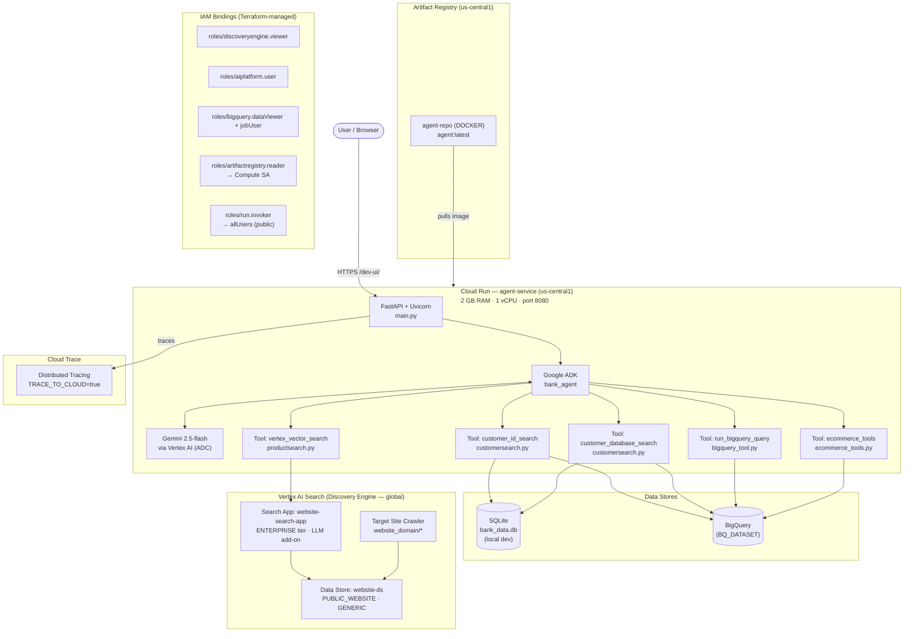

# Hackathon Starter

A starter template for building AI agents with [Google ADK](https://google.github.io/adk-docs/), Vertex AI Search, and BigQuery. It includes a vector search tool and a customer database tool — ready for you to wire into your own agent.

## Architecture



## What's Included

```
EDB-Hackathon-Starter/
└── ADKAgents/
    ├── bank_agent/
    │   ├── agent.py                # Your base agent — start here
    │   ├── prompt.py               # Agent instructions
    │   ├── observability/          # Built-in tracing & metrics
    │   │   ├── __init__.py         # setup_observability() entry point
    │   │   ├── config.py           # Env vars, model pricing
    │   │   ├── metrics.py          # Thread-safe in-memory metrics store
    │   │   ├── callbacks.py        # ADK before/after model callbacks
    │   │   ├── tool_tracer.py      # @traced_tool decorator
    │   │   └── otel_setup.py       # OpenTelemetry SDK bootstrap
    │   └── tools/
    │       ├── customersearch.py   # Customer lookup (BigQuery or SQLite)
    │       ├── productsearch.py    # Vertex AI vector search
    │       └── bigquery_tool.py    # General-purpose BigQuery query tool
    ├── datasets/                   # BigQuery dataset definitions — add your own here
    │   ├── bank.yaml               # Bank dataset (customers, accounts, transactions)
    │   └── ecommerce.yaml          # Ecommerce dataset (users, products, orders)
    ├── bq_seed/                    # Seed data files referenced by bank.yaml
    │   ├── customers.json
    │   ├── accounts.json
    │   └── transactions.json
    ├── deploy/
    │   ├── main.tf                 # Terraform — provisions all GCP infrastructure
    │   ├── tf_deploy.py            # One-shot full deploy (infra + image + Cloud Run)
    │   ├── tf_run.py               # Terraform wrapper (passes .env as TF vars)
    │   ├── bq_deploy.py            # Create and seed BigQuery datasets from datasets/*.yaml
    │   ├── bq_destroy.py           # Delete all BigQuery datasets defined in datasets/*.yaml
    │   └── obliterate.py           # Destroy all Terraform-managed resources and reset state
    └── setup_env.py                # Interactive .env setup
```

## Prerequisites

- **Docker** - [https://www.docker.com/products/docker-desktop/](https://www.docker.com/products/docker-desktop/)
- **Python 3.14+** — [python.org/downloads](https://www.python.org/downloads/)
- **uv** — [docs.astral.sh/uv/getting-started/installation](https://docs.astral.sh/uv/getting-started/installation/)
- **Terraform** — [developer.hashicorp.com/terraform/install](https://developer.hashicorp.com/terraform/install) or `winget install HashiCorp.Terraform` on Windows
- **Google Cloud SDK** — [cloud.google.com/sdk/docs/install](https://cloud.google.com/sdk/docs/install)
- A Google Cloud project with billing enabled

---

## GCP Project Setup

### Create a project

```bash
gcloud projects create YOUR_PROJECT_ID --name="Your Project Name"
gcloud config set project YOUR_PROJECT_ID
```

### Enable billing

```bash
# List your billing accounts
gcloud billing accounts list

# Link one to the project
gcloud billing projects link YOUR_PROJECT_ID --billing-account=BILLING_ACCOUNT_ID
```

### Authenticate

```bash
gcloud auth login
gcloud auth application-default login
gcloud auth application-default set-quota-project YOUR_PROJECT_ID
```

### Get a Gemini API key

**Option A — AI Studio (personal use):** Visit [aistudio.google.com/apikey](https://aistudio.google.com/apikey) and create a key.

**Option B — via gcloud (project-scoped):**

```bash
gcloud services enable apikeys.googleapis.com generativelanguage.googleapis.com
gcloud services api-keys create \
  --display-name="Gemini API Key" \
  --api-target=service=generativelanguage.googleapis.com
```

The key string is printed in the output — copy it into `GOOGLE_API_KEY` in your `.env`.

### Create a service account (recommended)

```bash
gcloud iam service-accounts create terraform-deployer \
  --display-name="Terraform Deployer" \
  --project=YOUR_PROJECT_ID
```

Then set `MEMBER_EMAIL` in your `.env`:

```dotenv
MEMBER_EMAIL=serviceAccount:terraform-deployer@YOUR_PROJECT_ID.iam.gserviceaccount.com
```

Terraform will grant this identity the roles it needs during `tf-deploy`.

---

## Setup

### 1. Install dependencies

```bash
cd ADKAgents
uv sync
```

### 2. Authenticate with Google Cloud

```bash
gcloud auth login
gcloud auth application-default login
gcloud config set project {YOUR_PROJECT_ID}
```

### 3. Configure your environment

Run the interactive setup — it will write `bank_agent/.env`:

```bash
cd ADKAgents
uv run setup-env
```

You'll be prompted for:

| Variable | Description |
|---|---|
| `GOOGLE_API_KEY` | Gemini API key — get one at [aistudio.google.com/apikey](https://aistudio.google.com/apikey) |
| `GOOGLE_CLOUD_PROJECT` | Your GCP project ID |
| `GOOGLE_CLOUD_LOCATION` | GCP location (default: `global`) |
| `WEBSITE_DOMAIN` | Domain for Terraform to crawl (e.g. `www.example.com`) |
| `VERTEX_DATA_STORE_ID` | Leave blank for now — populated after Terraform deploy |
| `BQ_DATASET` | Bank dataset name — used by customer search tools (leave blank to use local SQLite) |
| `ECOMMERCE_DATASET` | Ecommerce dataset name — used by order/product/sales tools |

### 4. Set up BigQuery data

The agent's customer search tools use BigQuery when `BQ_DATASET` is set in your `.env`. You have two options:

#### Option A — Deploy the included datasets

The repo ships two datasets defined in `datasets/*.yaml`. One command creates all of them:

```bash
cd ADKAgents
uv run bq-deploy
```

`bq-deploy` reads every `*.yaml` file in `datasets/`, creates the dataset and tables if they don't exist, and truncates+reloads the seed data. Run it again at any time to reset to a clean state.

To remove all deployed datasets:

```bash
uv run bq-destroy
```

This deletes every dataset defined in `datasets/*.yaml` (including all tables and data). Useful for a clean slate before re-running `bq-deploy`.

**Bank dataset** (`BQ_DATASET`) — 5 customers, 9 accounts, 19 transactions — queried by `customersearch.py`  
**Ecommerce dataset** (`ECOMMERCE_DATASET`) — 3 users, 4 products, 4 orders — queried by `ecommerce_tools.py`

Each dataset name is set in `.env` and referenced in its YAML via `${BQ_DATASET}` / `${ECOMMERCE_DATASET}`. Change the env var and both the deploy and the tools update together.

#### Option B — Add your own dataset

To deploy a dataset specific to your project, create a YAML file in `datasets/`:

```yaml
# datasets/my_dataset.yaml
dataset: my_dataset_name   # or ${MY_ENV_VAR} to read from .env

tables:
  - name: my_table
    schema:
      - {name: id,    type: STRING, mode: REQUIRED}
      - {name: label, type: STRING}
      - {name: score, type: FLOAT}
    seed_data:                      # inline rows
      - {id: "1", label: "alpha", score: 0.9}

  - name: another_table
    schema:
      - {name: id,   type: STRING}
      - {name: value, type: INTEGER}
    seed_file: bq_seed/another_table.json   # or reference a JSON file
```

Supported field types: `STRING`, `INTEGER`, `FLOAT`, `BOOLEAN`, `DATE`, `TIMESTAMP`. `mode` defaults to `NULLABLE` if omitted. Use `seed_data` for small inline rows or `seed_file` for a newline-delimited JSON file — not both on the same table.

Run `uv run bq-deploy` and your dataset appears alongside the others.

#### Option C — Point to an existing BigQuery dataset

If you already have data in BigQuery, set `BQ_DATASET` in `bank_agent/.env` to your dataset ID — no deploy step needed:

```dotenv
BQ_DATASET=your-existing-dataset-id
```

If `BQ_DATASET` is left blank, the customer search tools fall back to a local SQLite file (`bank_data.db`) for development without any GCP dependency.

### 5. Deploy infrastructure

```bash
cd ADKAgents
uv run tf-deploy
```

This runs `terraform init` + `terraform apply`, builds and pushes your container image via Cloud Build, and deploys to Cloud Run. **Expect this to take around 10 minutes** on a fresh project. Once complete, your `VERTEX_DATA_STORE_ID` and Cloud Run URL are printed automatically.

Terraform provisions the following resources:

| Resource | Details |
|---|---|
| **Artifact Registry** | Docker repo for the agent container image |
| **Vertex AI Search** | Discovery Engine data store + enterprise search app |
| **Cloud Run** | Containerised agent service (2 GB RAM, us-central1) |
| **IAM bindings** | Deployer SA + Cloud Run compute SA granted required roles |

You can also run individual Terraform commands via the `tf` wrapper:

```bash
cd ADKAgents
uv run tf plan
uv run tf apply
uv run tf output -raw vertex_data_store_id
uv run tf destroy
```

#### Last resort: obliterate

If your deployment is in a broken state and you need to start completely from scratch, use:

```bash
cd ADKAgents
uv run obliterate
```

This will destroy **all** Terraform-managed GCP resources (Cloud Run service, Artifact Registry, Discovery Engine data store, IAM bindings), delete local Terraform state, and reset your `.env`. You'll be asked to type the project ID to confirm. The GCP project itself is kept — only the resources inside it are removed. After obliterating, run `uv run tf-deploy` to redeploy cleanly.

For scripting or CI environments, pass `--force` to skip the confirmation prompt:

```bash
uv run obliterate --force
```

> **Note:** `obliterate` only removes Terraform-managed resources. BigQuery datasets are managed separately — run `uv run bq-destroy` to remove those.

### 6. Run the agent locally

```bash
cd ../ADKAgents
uv run python main.py
```

This launches the agent server on `http://localhost:8080/`. You can view the agent playground at `http://localhost:8080/` and the observability dashboard at `http://localhost:8080/obs`.

Alternatively, if you only need the default agent playground without the observability endpoints, you can run:

```bash
cd ADKAgents
adk web

# or, if you don't have `adk` installed globally
uv run adk web
```

---

## IAM Permissions

IAM roles are provisioned by Terraform alongside the data store. Set `MEMBER_EMAIL` in your `.env` file:

```dotenv
# ADKAgents/bank_agent/.env
MEMBER_EMAIL=user:you@example.com
# or for a service account:
# MEMBER_EMAIL=serviceAccount:sa@your-project.iam.gserviceaccount.com
```

`tf-deploy` reads this value automatically and passes it to Terraform as `TF_VAR_member_email`.

Terraform grants `roles/discoveryengine.viewer`, `roles/aiplatform.user`, `roles/bigquery.dataViewer`, and `roles/bigquery.jobUser` to that identity.

The Cloud Run compute service account is separately granted `roles/artifactregistry.reader` (to pull images) and `roles/bigquery.dataViewer` + `roles/bigquery.jobUser` (to query BigQuery at runtime).

---

## Building Your Agent

Open `ADKAgents/bank_agent/agent.py`. The agent is pre-configured with all three tools:

```python
from dotenv import load_dotenv
from google.adk.agents import Agent
from google.adk.models.google_llm import Gemini
from google.genai import Client

from .observability import (
    after_model_callback,
    before_model_callback,
    setup_observability,
)
from .prompt import AGENT_INSTRUCTION
from .tools.bigquery_tool import run_bigquery_query
from .tools.customersearch import customer_database_search, customer_id_search
from .tools.productsearch import vertex_vector_search
from .tools.ecommerce_tools import lookup_user_orders, check_product_stock, sales_reporting_query

load_dotenv()


class VertexGemini(Gemini):
    """Gemini model that unconditionally uses Vertex AI (ADC) instead of an API key."""

    @cached_property
    def api_client(self) -> Client:
        return Client(
            vertexai=True,
            project=os.getenv("GOOGLE_CLOUD_PROJECT"),
            location=os.getenv("GOOGLE_CLOUD_LOCATION", "us-central1"),
        )


# Initialise OpenTelemetry exporters and the metrics store.
setup_observability()

root_agent = Agent(
    name="bank_agent",
    model=VertexGemini(model="gemini-2.5-flash"),
    description="A helpful banking assistant.",
    instruction=AGENT_INSTRUCTION,
    tools=[customer_id_search, customer_database_search, vertex_vector_search, run_bigquery_query, lookup_user_orders, check_product_stock, sales_reporting_query],
    before_model_callback=before_model_callback,
    after_model_callback=after_model_callback,
)
```

| Tool | Dataset | Description |
|---|---|---|
| `customer_id_search` | `BQ_DATASET` | Look up a customer by ID — falls back to SQLite if `BQ_DATASET` is unset |
| `customer_database_search` | `BQ_DATASET` | Full profile + transaction history for the verified customer |
| `run_bigquery_query` | any | General-purpose SELECT tool; use `{dataset}` or `{ecommerce_dataset}` as placeholders |
| `lookup_user_orders` | `ECOMMERCE_DATASET` | Order history for a user by email |
| `check_product_stock` | `ECOMMERCE_DATASET` | Inventory and pricing for a product |
| `sales_reporting_query` | `ECOMMERCE_DATASET` | Arbitrary analytics queries against the ecommerce dataset |
| `vertex_vector_search` | — | Semantic search over your website via Vertex AI Search |

To build multi-agent pipelines, pass other `Agent` instances via `sub_agents=[...]`. Each sub-agent is invoked by name, and any inputs are forwarded as named keyword arguments matching its tool signatures.

---

## Observability

The starter pack ships with a **built-in observability layer** that automatically captures LLM and tool telemetry. No additional setup is required — it works out of the box.

### What is captured

| Signal | Details |
|---|---|
| **Token usage** | Input / output / total tokens per LLM call |
| **Cost** | Estimated USD cost per call, per session, per turn, or cumulative |
| **Latency** | Wall-clock time for each LLM call (avg, p50, p95) |
| **Prompt / response** | First 500 chars of the user prompt and model response (opt-in) |
| **Tool calls** | Per-tool invocation count, duration, success / error rates |

### How it works

1. **`before_model_callback`** stamps a start timestamp and (optionally) snapshots the user prompt.
2. **`after_model_callback`** extracts `usage_metadata` from the LLM response, computes latency and cost, and pushes a record to the in-memory metrics store.
3. **`@traced_tool`** wraps each tool function to measure execution time and record success/failure.
4. **OpenTelemetry** span attributes are emitted automatically when the SDK is available.

### API endpoints

Three JSON endpoints are added to the FastAPI app — useful for live demos and debugging:

| Route | Description |
|---|---|
| `GET /obs/summary` | Aggregated stats: total tokens, cost, latency percentiles. Optional `?granularity=session\|turn\|cumulative` query param. |
| `GET /obs/traces` | Individual LLM call records (newest first). Optional `?limit=N`. |
| `GET /obs/tools` | Per-tool call counts, success rates, and duration percentiles. |
| `POST /obs/reset` | Clear all recorded observability data. |

### Configuration

All settings are controlled via environment variables in `bank_agent/.env`:

| Variable | Default | Description |
|---|---|---|
| `TRACE_TO_CLOUD` | `false` | Set to `true` to export traces to Cloud Trace and metrics to Cloud Monitoring (requires GCP credentials). |
| `LOG_LLM_CONTENT` | `true` | Set to `false` to suppress prompt/response content from logs (token/cost metrics are still recorded). Recommended when handling PII. |
| `COST_GRANULARITY` | `session` | How cost is aggregated: `session`, `turn`, or `cumulative`. |

### Cloud Trace integration

When `TRACE_TO_CLOUD=true`:

- Traces are exported to **Cloud Trace** via the `opentelemetry-exporter-gcp-trace` package.
- Custom metrics (token counts, cost gauges) are pushed to **Cloud Monitoring** via `opentelemetry-exporter-gcp-monitoring`.
- Application Default Credentials (ADC) are used — make sure `gcloud auth application-default login` has been run, or that the Cloud Run service account has the required permissions.

When `TRACE_TO_CLOUD=false` (default), traces are printed to stdout via the `ConsoleSpanExporter`.

---

## Deploy to Cloud Run

`uv run tf-deploy` automates the full sequence below. If the script fails partway through, you can run these steps manually from the `ADKAgents` directory:

```bash
# 1. Enable the Cloud Resource Manager API (required before Terraform can enable anything else)
gcloud services enable cloudresourcemanager.googleapis.com --project YOUR_PROJECT_ID

# 2. Initialise Terraform
cd ADKAgents
uv run tf init

# 3. Phase 1 — provision infra (Artifact Registry, Discovery Engine data store, IAM bindings)
#    Pass an empty container_image so Cloud Run is skipped until the image exists
uv run tf apply -auto-approve -var=container_image=

# 4. Build and push the container image via Cloud Build
#    You can run steps 4 & 5 every time you want to redeploy your agent with recent changes
IMAGE_URL=$(uv run tf output -raw image_url)
gcloud builds submit --tag "$IMAGE_URL" --project YOUR_PROJECT_ID .

# 5. Phase 2 — deploy Cloud Run with the built image
uv run tf apply -auto-approve '-replace=google_cloud_run_v2_service.agent[0]'
uv run tf apply -auto-approve

# 6. Print outputs
uv run tf output -raw cloud_run_url
uv run tf output -raw vertex_data_store_id
```

Once deployed, open `{cloud_run_url}/dev-ui/` to access the agent web interface.
